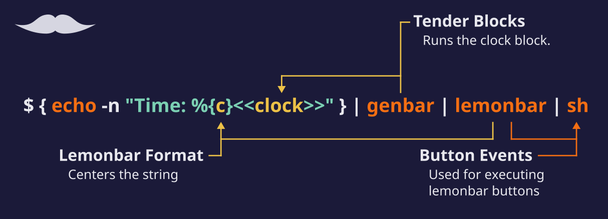
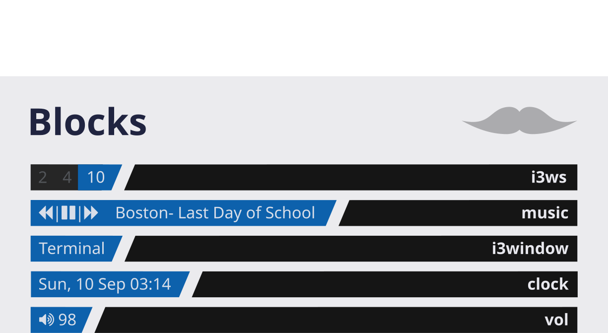

# Bartender


***

<p align="center">
<b><a href="#usage">Usage</a></b>
|
<b><a href="#installation">Installation</a></b>
|
<b><a href="#blocks">Blocks</a></b>
</p>

***
Simple, modular bar generator
Designed to be used with `lemonbar`

## Usage



*many more blocks to come... (contributions are very welcome)*

### Configuration

Bars can easily be generated using a shell script. The script must have the
genbar command and the commands under block in its path. Alternatively, the
`$TENDERBLOCKS` variable can be set to the blocks directory for genbar to
prepend to the path.

Next, the string for `lemonbar` is piped into `genbar`, where each
command to be run is delimited by `<<` and `>>`, which can be changed.

Finally, the output of `genbar` is piped into `lemonbar`. Each step can
be seen in the example script below. `lemonbar`'s output can also be
piped to sh for buttons.

### Example

````sh
#!/bin/sh

# Optional env variable used by genbar to prepend to the path
export TENDERBLOCKS="path/to/bartender/block"

# Between brackets the string to be piped is generated
# This allows us to break down the string into readable segments
# -n is used to not have a newline. Any command can be used, such as printf

# Make sure genbar is in the PATH
{

# Center
echo -n "%{c}"
echo -n "<<clock +%H:%M>>"

} | genbar | lemonbar | sh
````


## Installation

### Manual Installation

Bartender can simply be installed by cloning the repo and adding the root
directory to PATH. For the blocks, any script can be used. `genbar` allows the
usage of a `$TENDERBLOCKS` variable, which is prepended to the PATH. This can
be used to point to the `block` directory.

```
$ git clone https://github.com/Snowlabs/bartender ~/.local/share/Bartender
$ mkdir -p ~/bin
$ ln -sT ~/.local/share/Bartender/genbar ~/bin/genbar
$ chmod +x ~/bin/genbar
# make sure bin ~/bin is in your PATH
```

#### ~/.bashrc or ~/.zshrc
```bash
export TENDERBLOCKS="~/.local/share/bartender/block"
```

### Recommended Installation

We recommend using [zplug](github.com/zplug/zplug) for an easy installation:
(Don't forget to set the path to the tender blocks!)
#### ~/.zshrc
```zsh
export TENDERBLOCKS="<ZPLUG_HOME>/repos/Snowlabs/bartender/block"

zplug "Snowlabs/bartender", use:"genbar", as:command
```
*`<zplug_home>` is `~/.zplug` by default*

## Blocks
:bomb:: Event-based

:hourglass:: Not event-based

- :hourglass: <b><a href="#clock">clock</a></b>
- :hourglass: <b><a href="#disk">disk</a></b>
- :bomb:      <b><a href="#i3window">i3window</a></b>
- :bomb:      <b><a href="#i3ws">i3ws</a></b>
- :bomb:      <b><a href="#music">music</a></b>
- :bomb:      <b><a href="#vol">vol</a></b>


### clock


Prints the current time. Uses the same format as the `date` command.

| Option | Description | Default |
| :----: | ----------- | :-----: |
| `-n` | Update interval for the clock | `5` |
| | Format used by the `date` command | |

### disk


| Option | Description | Default |
| :----: | ----------- | :-----: |
| `-n` | Update inverval | `300` |
| `-H` | Make output human readable | `false` |
| `-t` | Type of info to output: size, used available, used% | percent |
| `-f` | Floating point precision for human-readable output | `2` |
| | Mountpoint of the partition | `/` |

Print info about the specified partition. Can print the disk size, used space,
available space and the used percentage.

### i3window


For i3wm, print the focused window.

Event-based

**Deps**: `python3`
**PyPI modules**: `i3ipc`

### i3ws


| Option | Description | Default |
| :----: | ----------- | :-----: |
| `-m` | Which monitor to show workspaces from | All |
| `-c` | Add lemonbar formatted scroll actions | |
| `-S` | Strip workspace numbers | |
| `-B` | Add lemonbar formatted numbers for changing workspace | |
| `-s` | Separator | |
| `-f` | Prefix and suffix for unfocused workspace | |
| `-F` | Prefix and suffix for focused workspace | |
| `-u` | Prefix and suffix for urgent workspace | |

Print the workspaces under i3wm.

Event-based

**Deps**: `python3`
**PyPI modules**: `i3ipc`

### music


Default button arguments use [fontawesome](http://fontawesome.io/).

| Option | Description | Default |
| :----: | ----------- | :-----: |
| `-f` | Specify the format of the output | |
| `-s` | Used with `-f`. Specify the spacer string | |
| `-p` | String for the previous button | |
| `-n` | String for the next button | |
| `-P` | String for the play button | |
| `-S` | String for the payse button | |

Print information about music, using various backends. Current supports only
`mpd`-based servers through `mpc`.

Event-based with `mpc`

**Optional deps**: `mpc`

### vol


| Option | Description | Default |
| :----: | ----------- | :-----: |
| `-j` | Use the jamyxer backend | |
| `-c` | Audio channel to use | |
| `-s` | Add lemonbar scroll buttons to change volume | |
| `-i` | Interval for changing volume (step) | |

Print volume information, for various backends. Currently supports: ALSA,
[jamyxer](https://github.com/Javyre/jamyxer)

Event-based with the jamyxer backend

**Optional deps**: `alsa-utils` or `jmctl` (from jamyxer)
